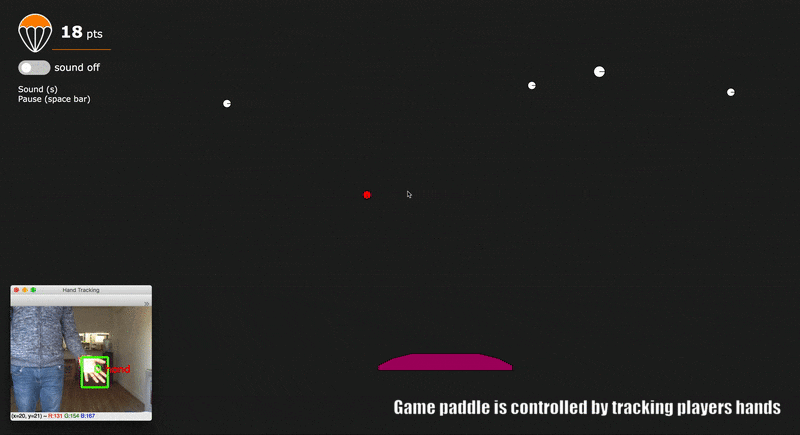
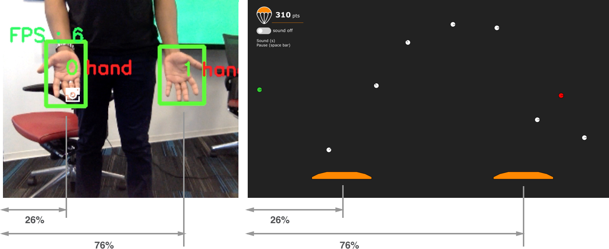

## SkyFall : Gesture Controlled Web based Game using Tensorflow Object Detection Api

> Control the game paddle by waving your hand in from of a web cam.



Skyfall is a physics based game in which users can control an onscreen paddle simply by moving their hands in front of a web cam. Light weight Convolutional Neural Networks (MobileNet, SSD) are used to detect the users hands which is then mapped to the controls of the game. The structure of the interaction supports multiple players (provided they can be accommodated in the field of view of the camera). The system demonstrates how the integration of a well-trained and light weight hand detection model is used to robustly track player hands and enable “body as an input” interaction in real-time (up to  20 fps).
 
## How it Works

A python application (app.py), detects the player’s hand using the TensorFlow object detection api,  and streams hand coordinates to the game interface — a web application served using FLASK — over websockets.

Hand detection is done using trained models from the [handtracking](https://github.com/victordibia/handtracking) repo. Note that hand detection is done on a frame-by-frame basis and the system does not automatically track hand across frames. However, this type of inter-frame tracking is useful as it can enable multiple user interaction where we need to track a hand across frames (think a bunch of friends waving their hands, each controlling their own paddle). To this end, the current implementation includes [naive euclidean distance](utils/object_id_utils.py) based tracking where hands seen in similar positions across frames are assigned same id.

Once each hand in the frame is detected (and a tracking id assigned), the hand coordinates are then sent to a web socket server which sends it out to connected clients.

The game web interface listens for hand detection data over a web socket. Each detected hand is used to generate a paddle, and the coordinate of the hand in the video frame is used to relatively position the paddle on the game screen.



# Next Steps/Todo

There are several limitations with the current implementation — so contributions, pull requests are most welcome!

**Hand Detector Improvement**
This entails collecting additional training data and leveraging data augmentation strategies to improve the hand detector. This is important as the entire interaction (and user experience) depends on accurate and robust hand tracking (false positives, false negatives make for bad UX).

**Inter-frame Tracking**
The current implementation uses a simple euclidean based metric to track hands across frames (hand in current frame is identified based on its distance from hands in previous frames). With several overlapping hands, things can get complicated— a more robust tracking algorithm is required. Perhaps integrating a fast tracking algorithm from OpenCV or other sources …

**Tensorflowjs implementation** 
Conduct some experiments with a TensorFlowjs implementation that allows the entire interaction to be prototyped completely in the browser!!! Tensorflowjs brings so many benefits — easy deployment (no python or Tensorflow installation), no websocket servers and clients, easy reproducibility, more potential users …


## Update 3/5/19 - Tensorflow.js implementation is now available

I exported the handtrack model using the Tensorflow.js converter and have it wrapped into an easy to use javascript library - [Handtrack.js](https://victordibia.github.io/handtrack.js/). You can do hand tracking in 3 lines of code, no installation, no model training, all in the browser.


Learn more below

- Blog Post:  [Hand Tracking Interactions in the Browser using Tensorflow.js and 3 lines of code.](https://medium.com/@victor.dibia/handtrackjs-677c29c1d585)
- Github: [Handtrack.js Github Repo](https://github.com/victordibia/handtrack.js)
- Live Demo : [Handtrack.js Examples in the Browser](https://victordibia.github.io/handtrack.js/)


## Installation

> The app has been tested using *Python 3*. Please use your Python 3 environment if possible.

Install requirements.

```
pip install -r requirements.txt
```

## Run  Application

```
python app.py
```

View the game interface (hand control) in your browser - `http://localhost:5005/hand` 

To view a simple mouse control version `http://localhost:5005` 

MIT License.
